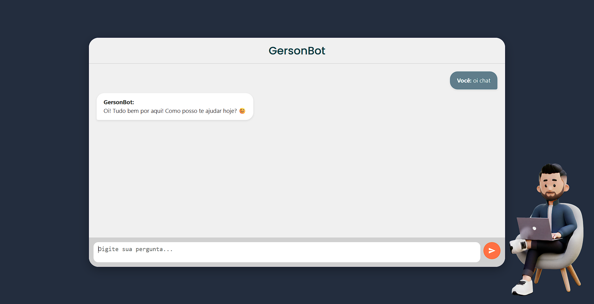

# 🤖 GersonBot



GersonBot é um **chatbot pessoal** desenvolvido para portfólio, que utiliza a **API Gemini do Google** para gerar respostas inteligentes.  
Feito com **HTML, CSS, JavaScript** e **Node.js (Express)**.  

🌐 **Acesse online:** [https://gersonbot.onrender.com/](https://gersonbot.onrender.com/)

---

## 📁 Estrutura do Projeto

- `server.js` - Servidor Node.js que conecta o site à API Gemini.  
- `public/` - Arquivos públicos do site: HTML, CSS, JS e imagens.  
- `.env` - Arquivo com a chave da API (não enviado ao GitHub por segurança).  
- `public/img/preview.png` - Preview do GersonBot para README.

---

## 🎨 Funcionalidades

- Chat em tempo real com respostas inteligentes da API Gemini.

- Avatar animado adaptável a diferentes tamanhos de tela.

- Layout responsivo e clean, pronto para portfólio.

- Mensagens com markdown suportado: negrito, listas, links e código.

---

## 📌 Notas

O projeto é para estudo e portfólio, com limite gratuito de requisições da API.  
Seus feedbacks ajudam a melhorar o projeto.

---

## 🚀 Como Rodar Localmente

1. Clone o repositório:  
   ```bash
   git clone https://github.com/seu-usuario/gersonbot.git
   cd gersonbot
2. Instale as dependências:
npm install

3. Crie um arquivo `.env` com a chave da API Gemini:
GEMINI_API_KEY=sua_chave_aqui

4. Inicie o servidor pelo terminal:
node server.js

5. Acesse o site em http://localhost:3000/